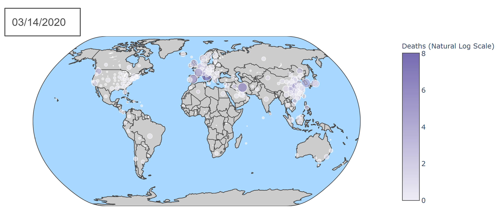
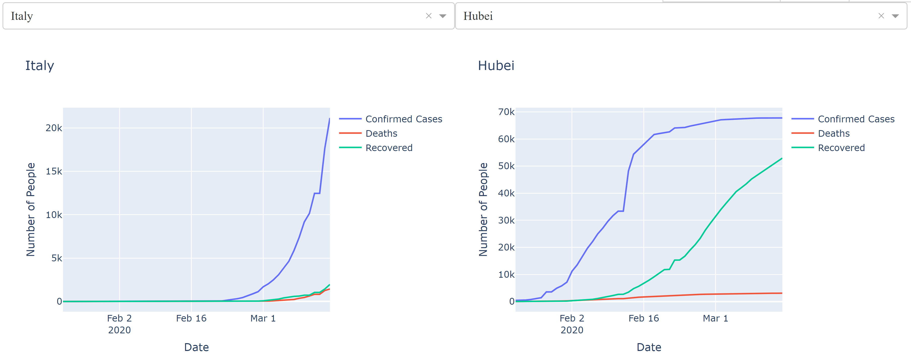

# Analysis of the Novel Coronavirus
### An interactive plotly dashboard application for the novel coronavirus dataset from Johns Hopkins.

## Research Questions
1. How has the novel coronavirus spread, changed over time? Essentially, where did it originate and how long did it take to spread to other areas?
2. How does the spread of the novel coronavirus in Italy compare to spread in Hubei, China?

## Example Visualizations

A map depicting COVID-19 cases by region as of March 14, 2020.

Side by side graphs depicting the number of confirmed cases, deaths, and recoveries over time in Italy and Hubei, China through March 14, 2020.

#### Uses a deprecated version of the [Johns Hopkins dataset](https://github.com/CSSEGISandData/COVID-19/tree/master/archived_data/archived_time_series), so data is no longer up to date.
